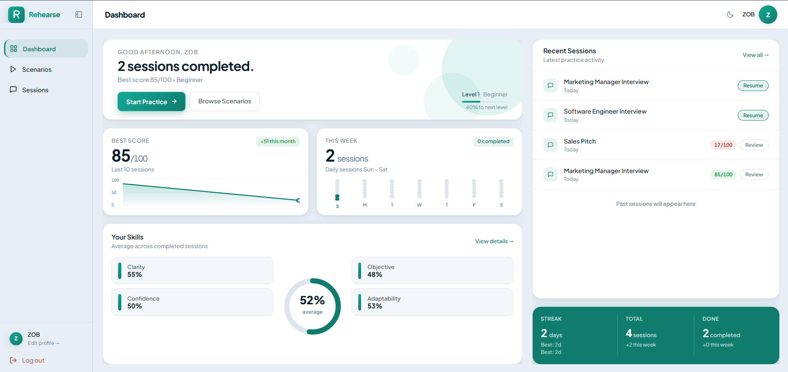
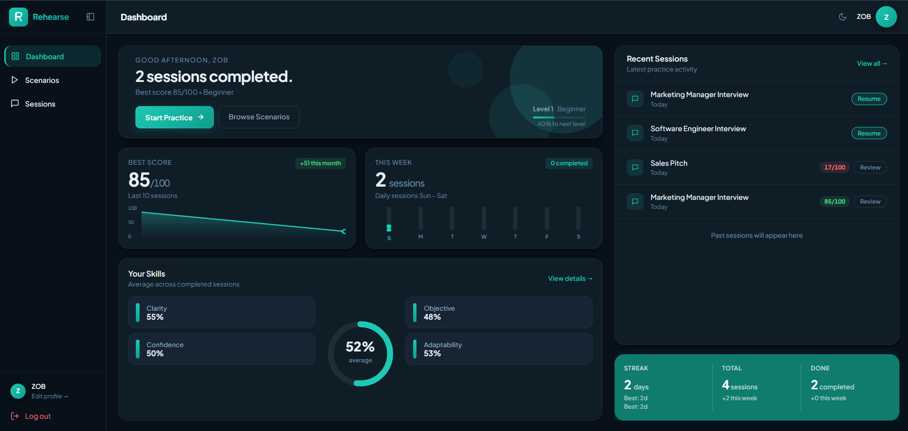
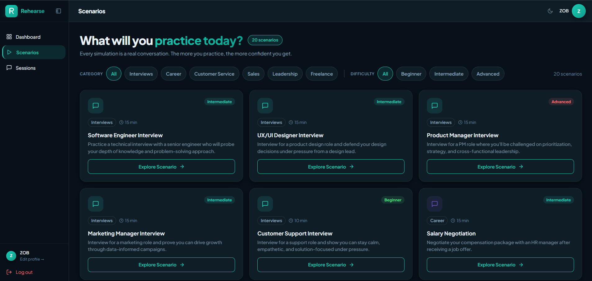
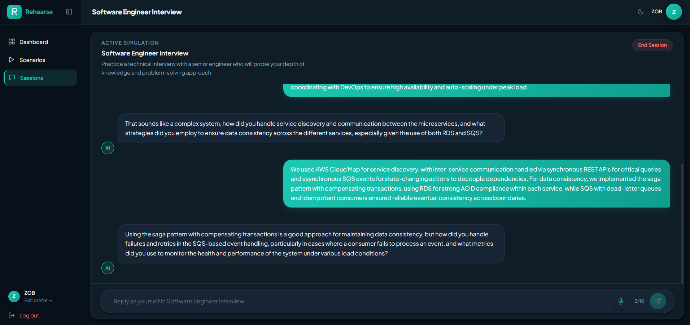
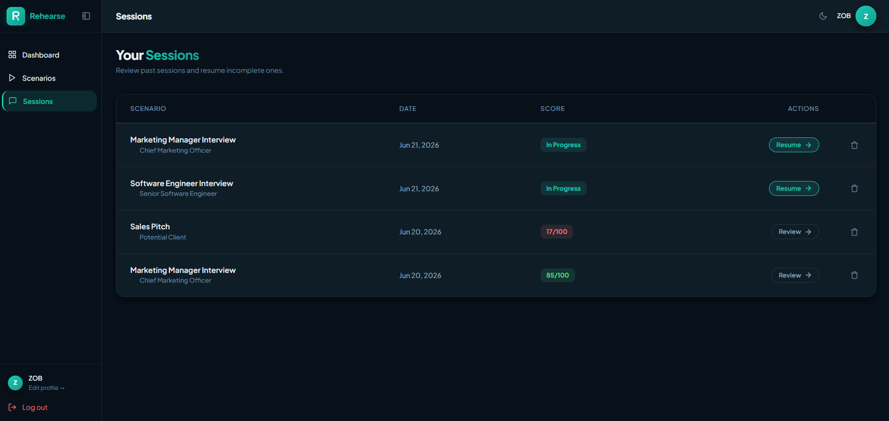
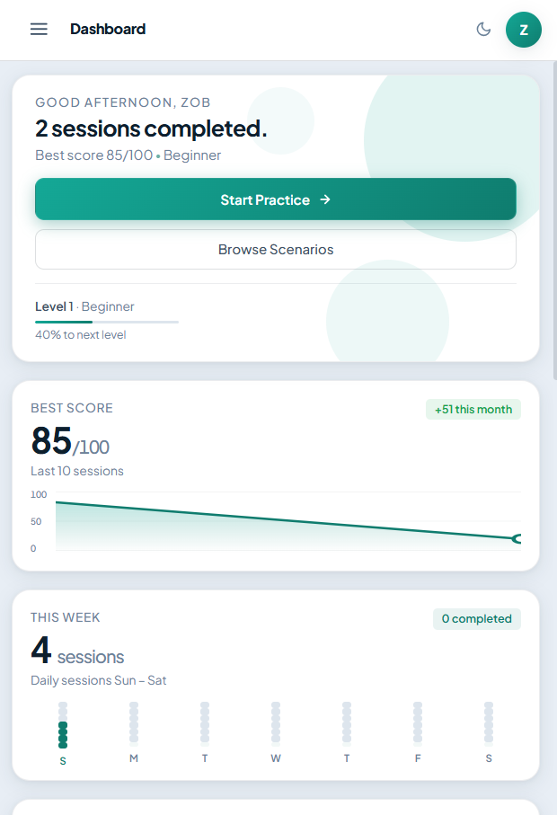

# Rehearse — AI-Powered Conversation Practice

Practice high-stakes conversations — interviews, salary negotiations, difficult workplace discussions — against a realistic AI persona, then get scored feedback on how you did.

Built with Laravel, Inertia.js, Vue 3, and the Groq API.



## Live Demo

**[your-railway-url-here]**

- **Register your own account** to test the full signup → practice → feedback flow.
- **Or use the demo account** to see a populated dashboard with session history:
    - Email: `zob@example.test`
    - Password: `12345678`

---

## Key Features

**AI roleplay** — 20 scenario-based simulations powered by the Groq API. The AI stays in character, responds conversationally in 1–3 sentence replies, and ignores attempts to break persona. Write routes are rate-limited (30 req/min/user) to protect API quotas.

**Scoring & feedback** — sessions auto-complete after 10 exchanges (or end manually anytime) and get graded out of 100 across four skills: Clarity, Confidence, Objective, and Adaptability, plus a personalized coaching summary.

**Analytics dashboard** — daily streaks, weekly activity tracking, and month-over-month skill growth. Dashboard data is cached for 1 hour and invalidated instantly on session start/finish.

**Session management** — browse, resume, delete past sessions, and export full transcripts with scores and feedback as PDF.

**Auth & security** — registration, login, password reset, and email verification via Laravel Breeze. Users can only view, resume, or delete their own conversations.

---

## Screenshots

| Dashboard (Light)                                  | Dashboard (Dark)                                 |
| -------------------------------------------------- | ------------------------------------------------ |
|  |  |

| Scenarios                                  | Conversation                              |
| ------------------------------------------ | ----------------------------------------- |
|  |  |

| Session History                          | Mobile View                           |
| ---------------------------------------- | ------------------------------------- |
|  |  |

---

## Tech Stack

Laravel 13 · PHP 8.4 · Vue 3 · Inertia.js · Tailwind CSS · MySQL · Groq API · Laravel Breeze

---

## Local Setup

```bash
git clone https://github.com/zobdhillon/rehearse.git
cd rehearse

composer install
npm install

cp .env.example .env
php artisan key:generate
```

Update `.env` with your database and Groq API key:

```env
DB_CONNECTION=mysql
DB_HOST=127.0.0.1
DB_DATABASE=rehearse
DB_USERNAME=root
DB_PASSWORD=

GROQ_API_KEY=your-groq-api-key
```

```bash
php artisan migrate --seed
npm run build
php artisan serve
```

Visit `http://localhost:8000` and register an account.

**Run tests:**

```bash
php artisan test
```

---

Built as a portfolio project to demonstrate full-stack development with Laravel and Vue — including third-party AI API integration, real-time conversational UI, data visualization, and responsive design across light/dark themes.
